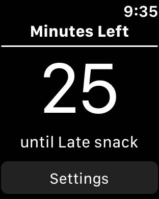
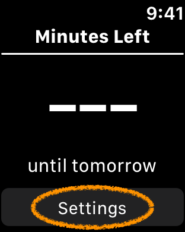
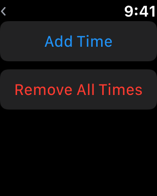
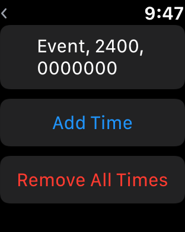
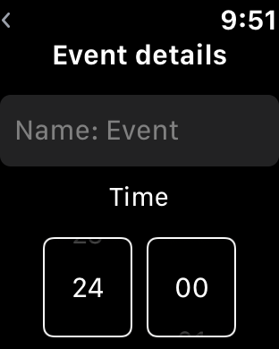
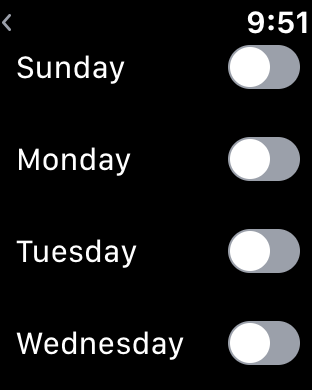
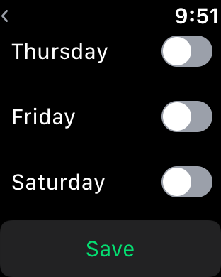
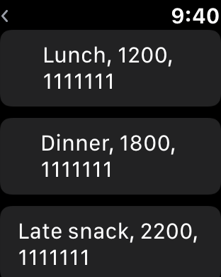

# MinutesLeft
An app that tells you how many minutes are left before your next event.

### Inspiration
I like using minutes as a metric to tell myself how long something will take or how long until I should go somewhere. Once a time gets closer (like the start of class for example), the minute representation would be the most useful for me to figure out how long I have and how long it will take to get to my event (15 minutes to walk to the quad or 30 minutes to drive to work). Thus came the inspiration for this app. 

### Future Work
For future work, I'd consider implementing this to directly take data from Apple Calendar and/or Google Calendar so that you don't need to completely reconfigure all of the times yourself when getting the WatchApp. But also, you would only have info on the next event so maybe this could be extended to allow you to scroll through events so that it would have a calendar aspect as well.

## Technical Setup
To get the WatchApp, you will need to go through Xcode to download it to your Apple Watch using an Apple Developer account. Tutorials for this can be found online.

## How to Use
### Set up app
To set up the app, you must click on the Settings button of the app as shown below:

Then the following screen will show up (assuming you just downloaded to the watch so the configuration starts off empty):

### Add Event
To add events with times, just tap on the green "AddTime" button.
Once you do that, an event will be added with default settings (midnight and off for all weekdays so it won't change anything on the interface). To give the Time you added meaning, you must edit the event.

### Edit Event
To edit an event, you first tap on the event you would like to edit. Then you will see the event's configuration page:

From those selections, you will be able to edit the name, time (24-hour based), and days of the week for your events.

### Example of an app with configurations
Once the WatchApp is configured, the Settings page may look something like this:

In the above example, you can tell that there are 3 events shown (maybe more if we scroll down), with the following information that you can gather:

Event 1. Named "Lunch", will occur at noon, and will happen on every day of the week (hence "1111111")

Event 2. Named "Dinner", will occur at 6pm, and will happen on every day of the week (hence "1111111")

Event 3. Named "Late Snack", will occur at 10pm, and will happen on every day of the week (hence "1111111")

